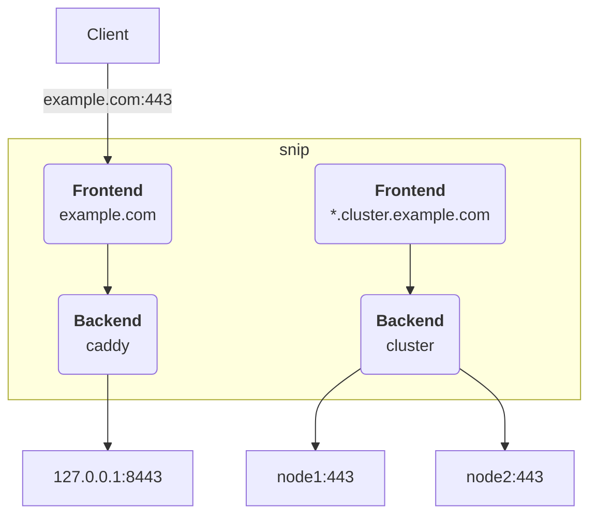

# snip

A tiny TLS pass-through reverse proxy and load balancer based no peeking SNI messages.
It also supports proxying to upstreams via
[PROXY protocol](https://www.haproxy.org/download/1.8/doc/proxy-protocol.txt) version 2.

PROXY protocol allows to retain a client's remote ip address and is widely supported by all major
web servers and reverse proxies, e.g. Apache, Nginx and Caddy.
It is like the `X-Forwarded-For` header but for TLS connections.

## Motivation

I was using Nginx as a TLS pass-through reverse proxy in production.
It works fine but there is one problem: It does not allow to enable PROXY protocol for some
upstreams only.
Instead, the protocol can either be enabled globally for all upstreams or not at all.

After a quick research session I discovered that writing a TLS pass-through proxy is actually
rather simple and Go provides all the TLS and SNI logic out of the box.
The two external dependencies are for speaking PROXY protocol to backends and parsing the
TOML configuration file.

## Usage

Create a suitable configuration file at `/etc/snip/config.toml` (or anywhere else) and start snip.
It currently accepts a single optional flag to set the location of the configuration file via
`--config`.

Validate the configuration by running the following command: `snip [--config PATH] validate`.
It will print some information and the exit code will be adjusted accordingly.

Snip is able to reload its configuration without restarting.
Send the `USR1` signal to the running program to trigger a reload, e.g. `kill -USR1 $PID`.
Please also have a look at the provided Systemd service at `./snip.service`.

## Configuration

Please have a look at the exemplary configuration file at `./config.toml`.
It contains detailed information about each setting and some usage examples.

There are two main concepts in the architecture of snip: frontends and backends.
Traffic from clients is routed from a frontend to a backend and then to an upstream server.

The following chart provides an overview.

### Frontend

A frontend is an exact domain, a wildcard or a catch-all matcher.
Each frontend has to specify a backend to route incoming traffic to.
The specified backend can either be a named backend, hostname or ip address of an upstream server,
e.g. `10.0.0.20:443` or `node1:443`.
A port must be specified if another host or ip address is specified directly.

Otherwise, a named backend will be looked up in the declared backend configuration.
In this case a port must not be specified.
See below for more information.

### Backend

A backend is an upstream server to which traffic should be proxied.
It consists of a unique name, a list of hostnames or ip addresses of upstream servers and some
optional configuration.

Each upstream should be in the common address and port format, e.g. `10.0.0.20:443` or `node1:443`.
Connections will be balanced randomly between all upstreams.
Currently, there are no health checks implemented, meaning that the connection will be dropped if
the first chosen upstream is down.
In the future, additional balancing methods and proper health checking may be implemented.

To enable PROXY protocol, set `proxy_protocol = true` on the backend.
Optionally, it is also possible to overwrite the global value of `connect_timeout` for each
backend.

## Build

1. Install Go >= 1.22
2. Run `make` or `go build -o bin/snip cmd/snip/main.go`
3. Use the binary at `bin/snip` and install it to e.g. `/usr/local/bin/snip`.

### Nix and NixOS

Run `nix shell github:st3iny/snip` to build and test the program.
